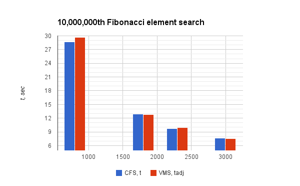

# Scheduler

*Written by Andrii Berezovskyi, Armand Zangue & Tamilselvan Shanmugam*

## Integration into the kernel

The scheduler was integrated into the kernel scheduling subsystem by making
changes in the following places.

### Data structures

The OSPJ scheduler has introduced several changes to the data structures,
mainly located in two `sched.h` files^[`kernel/sched/sched.h` and
`include/linux/sched.h`].

First, the `'struct ospj_rq'` was defined:

```{style="c" caption="kernel/sched/sched.h" firstnumber=365}
struct ospj_rq {
	struct list_head ospj_list_head;
	struct list_head *ptr_eligible_q;
	struct list_head *ptr_waiting_q;
	struct list_head eligible_q;
	struct list_head waiting_q;
	struct rq *rq;
	struct task_struct *idle;
	unsigned int nr_running;
	unsigned int idle_request;
	unsigned int period_ticks;
};
```

Main point of interest is the existence of two queues, `eligible_q` and
`waiting_q`. The meaning of both queues will be explained below. Another
interesting components are the queue pointers also defined in the structure.
They are specifically defined for easy process of swapping the queues (also
explained later). The runqueue is designed to hold all the tasks assigned to
the responsible scheduling class on one processor. Each CPU has its own
runqueue, which holds the runqueue stuctures for each scheduling class:

```{style="c" caption="kernel/sched/sched.h" firstnumber=413}
/*
 * This is the main, per-CPU runqueue data structure.
 * ...
 */
struct rq {
	...
	struct cfs_rq cfs;
	struct rt_rq rt;
#ifdef CONFIG_SCHED_VMS
	struct ospj_rq ospj;
#endif /* CONFIG_SCHED_VMS */
	...
}
```

Finally, the scheduling class is defined on a per-task basis:

```{style="c" caption="include/linux/sched.h" firstnumber=1055}
struct task_struct {
	...
	const struct sched_class *sched_class;
	...
#ifdef CONFIG_SCHED_VMS
	struct sched_vms_entity vms;
	struct list_head ospj_list_node; /* list item to insert task into Q */
	unsigned int share;
	unsigned int ospj_time_slice;
	unsigned int ospj_assigned_time_slice;
#endif /* CONFIG_SCHED_VMS */
	...
	unsigned int policy;
```

In order to understand how the `sched_class` is set, we need to look into the
scheduler hierarchy.

### Scheduler hierarchy

In order to register a scheduler in a kernel, one must provide a structure
initialized with the pointers to the scheduler functions. Below you can find
the excerpt of the structure defined for our scheduler:

```{style="c" caption="ospj.c" firstnumber=556}
const struct sched_class ospj_sched_class = {
	.next				= &idle_sched_class,
	.enqueue_task		= enqueue_task_ospj,
	.dequeue_task		= dequeue_task_ospj,
	.yield_task			= yield_task_ospj,

	.check_preempt_curr	= check_preempt_curr_ospj,

	.pick_next_task		= pick_next_task_ospj,

...

};

```

This allows the scheduler subsystem (implemented mainly in `core.c`) to perform
generic calls to every scheduler, e.g. the following snippet from the
`pick_next_task` function:


```{style="c" caption="core.c" firstnumber=2949}
for_each_class(class) {
	p = class->pick_next_task(rq);
	if (p)
		return p;
}
```

However, before the function of our new scheduling class is going to be called
in this manner, we have to put a pointer to our `struct sched_class` structure
into the linked list that is being iterated in this `for` loop. The head of
this list is defined in `sched.h`^[there is also defined another header under
`include/linux/sched.h`]:

```{style="c" caption="kernel/sched/sched.h" firstnumber=1041}
#define sched_class_highest (&stop_sched_class)
```

Then, each next node of the list is defined in the `next` field of the `struct
sched_class` structure:

```{style="c" caption="Designated initializer in kernel/sched/sched.h" firstnumber=105}
const struct sched_class stop_sched_class = {
	.next			= &rt_sched_class,
	...
}
```

The original hierarchy is ordered as follows:

1. Stop scheduler class.
2. RT scheduler class.
3. Fair scheduler class.
4. Idle scheduler class.

Our implementation inserts a new scheduler class after the fair scheduler right
before the idle class:

```{style="c" caption="fair.c" firstnumber=6167}
const struct sched_class fair_sched_class = {
#ifdef CONFIG_SCHED_VMS
	.next			= &ospj_sched_class,
#else
	.next			= &idle_sched_class,
#endif /* CONFIG_SCHED_VMS */
}
```

### Configuration flags

As you can see, the "insertion" is done conditionally, depending on whether the
kernel was configured with `CONFIG_SCHED_VMS` flag.

The kernel flag itself is defined in the `Kconfig` file:

```{style="c" caption="/Kernel/arch/x86/Kconfig" firstnumber=2334}
menu "VMS scheduler (OSPJ)"

config SCHED_VMS
	bool "Virtual Machines Scheduling (VMS) policy"
	default y
endmenu

}
```

This flag is also used to link project-related object files at the later build stage:

```{style="c" caption="/Kernel/kernel/sched/Makefile" firstnumber=20}
obj-$(CONFIG_SCHED_VMS) += ospj.o
obj-$(CONFIG_SCHED_VMS) += ospj_green_peace.o
```

### Changing scheduling policy to SCHED_VMS

The purpose of `sched_setscheduler` syscall is to change the scheduling policy
of given `pid` to `SCHED_VMS`.

The OSPJ policy defines a new property of process *share* that has to be passed
to the syscall. For this purpose, the `sched_param` structure was also
modified:

```{style="c" caption="include/linux/sched.h" firstnumber=7}
struct sched_param {
	int sched_priority;

#ifdef CONFIG_SCHED_VMS
	unsigned int share;
#endif /* CONFIG_SCHED_VMS */
};
```

This modified syscall verifies following parameters before changing the policy:

1. Policy should be valid or recognized by the scheduler.
2. Priority of the policy should be valid. In `SCHED_VMS` case, valid priority
   is `0`.
3. User should have appropriate permission to change the scheduling policy.
4. Valid share (1 to 100) must be given.

If all the conditions are satisfied, the scheduling policy of process `pid` can be successfully changed to `SCHED_VMS`.

## Design and implementation

### Queues

The scheduling class performs periodic scheduling using 2 FIFO queues. There is
a need for 2 queues to be in place for implementing a no-return policy for the
tasks that have finished their allotted time (or, depending on the scheduling
mode, those that yielded their priority before running out of time).

This way, each task which is determined not be allowed to return to the main
`eligible_q` queue, are put into the `waiting_q` instead. The queues are
eventually swapped, as outlined later in this section under **Queue
operations** subsection.

### Time allocation

Each VCPU has a time slice within a superperiod computed according to the share
passed in the `sched_setscheduler` system call. The time slice^[One time slice
is equal to 10ms] itself is then calculated by calling the
`ospj_calc_time_slice` function:

```{style="c" firstnumber=3890 caption="core.c"}
__setscheduler_vms(struct rq *rq, struct task_struct *p, int policy, int share)
{
	if(policy == SCHED_VMS && share > 0 && share <= 100) {
		p->sched_class = &ospj_sched_class;
		p->policy = policy;
		p->share = share;
		p->prio = 0;

		ospj_calc_time_slice(p, share);
	...
```

On each call of the `task_tick_ospj`, the task time slice is decremented. When
the time slice reaches 0, it is replenished immediately and the task is
forcibly rescheduled:

```{style="c" firstnumber=357 caption="ospj.c"}
if (--p->ospj_time_slice == 0) {
		...
		p->ospj_time_slice = p->ospj_assigned_time_slice;
		set_tsk_need_resched(p);
		yield_task_ospj(rq);
		return;
	}
```

### Task rescheduling

When the task is rescheduled, it is moved from the `eligible_q` to the
`waiting_q`:

```{style="c" firstnumber=174 caption="ospj.c"}
static void requeue_task_ospj(struct rq *rq, struct task_struct *p)
{
	list_move_tail(&p->ospj_list_node, rq->ospj.ptr_waiting_q);
	dprintk(KERN_DEBUG, "[OSPJ] requeue(): del %d, n = %d\n",
		   p->pid, rq->ospj.nr_running );
}
```

Next task is picked by the `pick_next_task_ospj` function. Generally, during the
non-idle period, the next task is picked from the `eligible_q`:

```{style="c" firstnumber=283 caption="ospj.c"}
next = list_entry(rq->ospj.ptr_eligible_q->next, struct task_struct, ospj_list_node);
next->se.exec_start = rq->clock_task;
```

Otherwise, the *idle* period lasts until the end of the superperiod.

### Idle period

After the *eligible* tasks have been scheduled in current superperiod, it is
checked if there is any time left. In case of success, the ownership of the
idle task is taken in the `pick_next_task_ospj` (see `ospj.c:244`).

During this period, the power code is supposed to be run instead of simply
halting the processor. During this phase, the OSPJ scheduler is receiving task
tick calls while the idle task is executing.

After the last tick, the scheduling class of the idle task is set back to
`idle_sched_class`. This is done in two steps:

1. `rq->ospj.idle_request` is set to `0` in `task_tick_ospj`.
2. Subsequent call to `pick_next_task_ospj` results in the actual assignment
   (`ospj.c:265`).

### Superperiod repetition

Finally, after the superperiod has ended (i.e. `ospj.period_ticks == 0`),
the superperiod is replenished and starts over again with queue swapping. 

### Queue operations

One of the main operations performed with the queues is *swapping*, which
happens in the `pick_next_task_ospj` function:

```{style="c" caption="ospj.c" firstnumber=242}
if (is_idle_period(rq)) {
	...
	/* Swap Qs */
	tmp = rq->ospj.ptr_waiting_q;
	rq->ospj.ptr_waiting_q = rq->ospj.ptr_eligible_q;
	rq->ospj.ptr_eligible_q = tmp;
	d("Queues swaped\n");
}
```

As you might see above, it is not the queues itself that are compared, but
their pointers. These pointer fields are initialized in the `init_ospj_rq`
call:

```{style="c" caption="ospj.c" firstnumber=63}
ospj_rq->ptr_eligible_q = &ospj_rq->eligible_q;
ospj_rq->ptr_waiting_q = &ospj_rq->waiting_q;

ospj_rq->idle_request = 0;

INIT_LIST_HEAD(&ospj_rq->ospj_list_head);
INIT_LIST_HEAD(ospj_rq->ptr_eligible_q);
INIT_LIST_HEAD(ospj_rq->ptr_waiting_q);
```

## QEMU threading model

As our scheduler is primarily targeted at scheduling QEMU threads, it is
worthwhile to discuss its internals that are relevant to the project.

When QEMU is started with 2 virtual CPUs, it creates 3 permanent threads:

- 2 threads correspond to 2 VCPUs
- 1 thread is responsible for handling IO operations

Other threads are temporary/permanent and correspond to any of the following
categories:

- Configuration dependent threads
- Worker threads
- Dedicated threads
- Reusable threads


***Configuration dependent threads:*** It depends on the virtual machine
features. E.g.: VNC thread, Gluster/Ceph.

***Worker threads:*** Sometimes long-running computations simply hog the CPU
and are difficult to break up into callbacks. In these cases dedicated worker
threads are used to carefully move these tasks out of core QEMU.

Examples of worker thread users are `posix-aio-compat.c`, `ui/vnc-jobs-
async.c`. Worker threads perform specialized tasks and do not execute guest
code or process events.

***Dedicated threads:*** Dedicated to perform only one task if the task is
active, e.g. audio processing.

***Reusable threads:*** `thread-pool.c` generates reusable threads.

In general threads will have the same CPU affinity as the main loop/iothread.
There are QMP APIs to query the `tid`'s of some threads.

Also, it is possible to interact with QEMU via the QMP interface. As this
interaction was not viable from kernel-space, this option was abandoned. Sample
code is provided in **Appendix A**. Also, links to useful resources are
provided at the end of the chapter.

## Scheduler evaluation

In order to test how well the scheduling subsystem performs, performance
measurements were taken using the Fibonacci element calculation program.

The measurements were performed at each frequency step with the following
configurations (5 times for each configuration to produce a statistically
significant result):

- CFS scheduler
- VMS scheduler with 50% share

The results show that the calculation is done in very similar time, while VMS scheduler showing better results in 2 measurements and CFS - in 2 others (especially taking into account that the difference in terms of performance is comparable to the standard deviation within the series of a single measurement):



The table with the full measurement data is supplied separately.

## Useful resources

### Scheduler

- [http://wiki.xen.org/wiki/Credit_Scheduler](http://wiki.xen.org/wiki/Credit_Scheduler)
- [http://www.embedded.com/design/operating-systems/4204929/Real-Time-Linux-Scheduling-Part-1](http://www.embedded.com/design/operating-systems/4204929/Real-Time-Linux-Scheduling-Part-1)

### QEMU

- [http://wiki.qemu.org/QMP](http://wiki.qemu.org/QMP)
- [http://dachary.org/?p=1474](http://dachary.org/?p=1474)
- [https://rubygems.org/gems/qemu](https://rubygems.org/gems/qemu)
- [https://rubygems.org/gems/qemu-toolkit](https://rubygems.org/gems/qemu-toolkit)
- [https://pypi.python.org/pypi/PyQemu/0.1](https://pypi.python.org/pypi/PyQemu/0.1)
- [http://blog.vmsplice.net/2011/03/qemu-internals-overall-architecture-and.html](http://blog.vmsplice.net/2011/03/qemu-internals-overall-architecture-and.html)
- [http://comments.gmane.org/gmane.comp.emulators.qemu/135139](http://comments.gmane.org/gmane.comp.emulators.qemu/135139)
