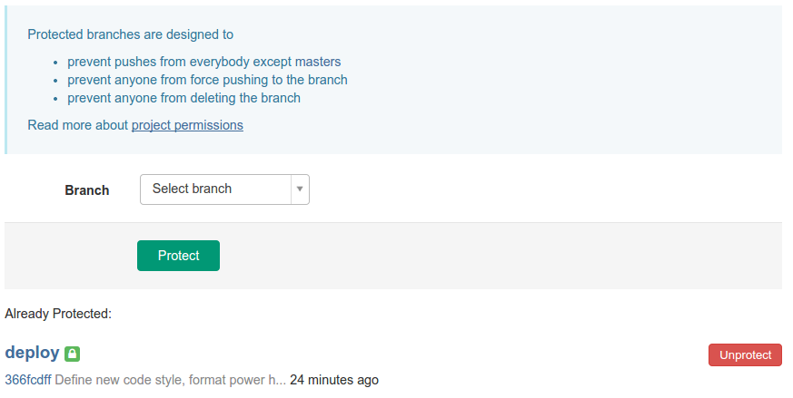
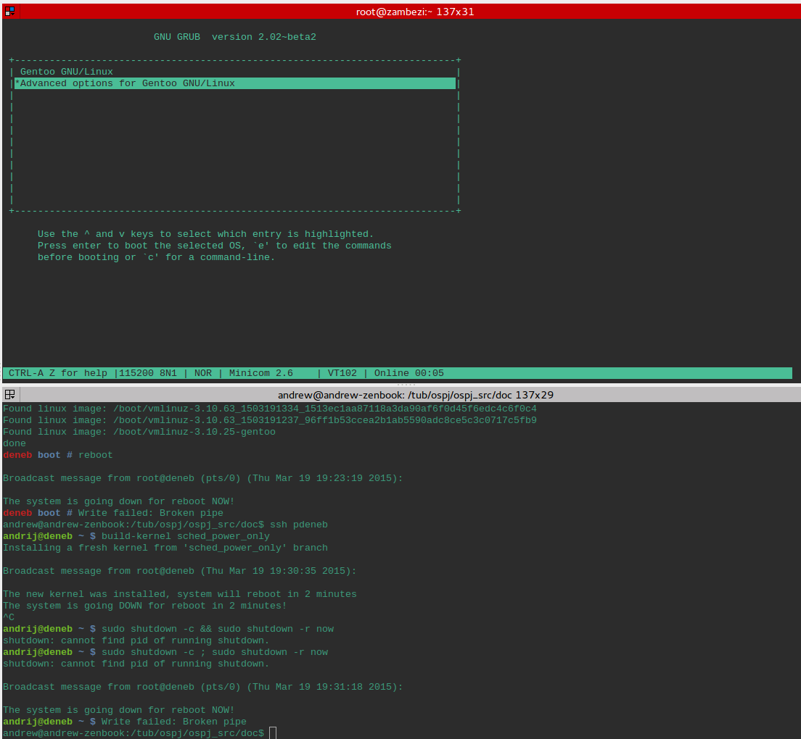

# Setup

*Written by Andrii Berezovskyi*

> Just as a preface, I would like to ask you: do not try working on kernel
> under Windows, heaven forbid! Otherwise, you'll immediately run into an
> [issue](http://stackoverflow.com/questions/3689137/error-git-checkout-index-
> unable-to-create-file) while cloning the kernel repository, namely with
> checking out the `aux.c` file^[And, hopefully, many others :)].

## Overview

The development of the project was organized as follows: the code was kept
under Git, continuous integration was performed using Jenkins and custom
scripts on the test server. Custom-built kernels were tested in QEMU, as well
using serial terminal connections to the test server and `printk` statements
that were output to the syslog.

## Development

### Git & Gitlab

The Git repository follows these guidelines: compiling and QEMU-passing code is
committed to the `master` branch and Jenkins checks the master branch regularly
and upon a build success it merges `master` branch to `deploy`. The deploy
branch itself is marked as protected in Gitlab.



### Jenkins CI

CI server runs on the local network on the server with hostname `zambezi`. The
Jenkins installation runs on port `8080` so you can access it at
[http://zambezi:8080](http://zambezi:8080) when you're connected to the local
network (or when you're logged in to the `poolgate` or `deneb`). If you're
outside of the network, set up your connection as described in the forum post
message #16.

*How does the CI process happen and do I have to care about it?*

The CI process it triggered automatically whenever you push anything to the
master branch on Gitlab. Thus, it's better if you merge your changes to the
master branch more often than if you merge 20 commits at the same time (I hope
it would trigger 20 separate builds but we still need to see how it goes).

The Jenkins server would check out the recent copy of the source and try to
build it. If the build succeeds, it's pushed to the `deploy` branch (for now
the keys are attached to my account so you'll see them as my commits, but we'll
resolve that later if we'll get some time allocated for that).

On `deneb`, there is a cron task (`/etc/crontab`) that pulls the `deploy`
branch every 15 minutes. If the actual kernel release (`uname -r`) of the
server doesn't match the latest change in the repository, then the new kernel
is built and installed on `deneb`. If the installation was successful, all
users with open terminal sessions are warned that server will reboot in 5
minutes and then the server reboots with the new kernel.

*Okay, shall I care at all about that?*

- If you expect to see some changes, but they're not working (or if you see
  some changes you didn't expect :P), check the current kernel release (`uname
  -r`).
- If you plan to run long-running tasks in the background, beware that reboot
  may interrupt them.

## Testing

### QEMU

In order to run the QEMU emulator, you need to do the following steps:

1. Compile the `sched_test` in the `Userspace` folder
2. Run the `rebuild-initramfs.sh` script in QEMU folder
3. If you don't have KVM or you want a single-core machine, run `cmd-
single.sh` script.
4. If you have KVM and you want a 4-core machine, run `cmd.sh` script (you
might need `sudo` for it, though).

General advice is not to execute `rebuild-initramfs.sh` with `sudo` privileges
as it will change ownership of the generated files.

### Access to the test server

In order to access `deneb` from the global network (inlcuding eduroam^[Please
note that at TEL-building the DNS & SSH connections from guest network are
blocked.]), you must connect to the gateway first:

```{style="simple"}
ssh <$tubit_user>@poolgate.kbs.tu-berlin.de -p 20122
```

The SSH will prompt for a password, use your tubIT password. If this action
fails, you shall write a letter to our administrator^[Matthias Druve
\<<matthias.druve@tu-berlin.de>\>] and ask for an account on `poolgate`.

From there, you shall be able to log in to `deneb`:

```{style="simple"}
ssh your_deneb_login@deneb
```

### Serial login and boot debugging

In case of kernel panic, the stacktrace is printed on the screen in most cases.
Unfortunately, the stack trace can span multiple screens and vitally important
information gets lost.

To overcome this issue, we set up the login to the server over the serial tty.
We also set up the GRUB over serial later as well. This way, by connecting the
serial-to-USB converter^[We used 
[this Logilink](http://www.amazon.de/LogiLink-AU0002E-Adapter-unterst%C3%BCtzt-Windows/dp/B00CB5WGZO)]
(through the
[null modem](http://www.ebay.com/itm/DB9-Female-F-Null-Modem-Nul-Cross-Serial-RS232cable-gender-changer-Adapter-SHdis-/291410124222)

 - **beware, it must be
crossing!**^[A gender changer similar to [this one](http://www.amazon.de/Gender-Changer-D-SUB-pol-Buchse/dp/B000LB4N3I/) didn't work for us!])
to the Jenkins server USB port and opening a `minicom` inside `screen` on
Jenkins server, we always had the boot and crash output available upon SSHing
into the Jenkins server (`zambezi` in our case).

The login capability was enabled by uncommenting a line in the `/etc/inittab`
file:

```{style="simple"}
# SERIAL CONSOLES
s0:12345:respawn:/sbin/agetty -L 115200 ttyS0 vt100
```

The GRUB over serial output was enabled via adding the following lines to `/etc/default/grub`:

```{style="simple"}
GRUB_TERMINAL_INPUT="console serial"
GRUB_TERMINAL_OUTPUT="console serial"
GRUB_SERIAL_COMMAND="serial --speed=115200 --unit=0 --word=8 --parity=no --stop=1"
```



You can read more on this and other debug-related questions in [Arch
Wiki](https://wiki.archlinux.org/index.php/Boot_debugging).

## Useful information

### Commands and advanced SSH configuration 

Speaking of logins, there are two interesting commands:

```{style="simple"}
smarx721@bs200 ~ $ w
 19:43:01 up 14 days,  9:46, 15 users,  load average: 0.00, 0.01, 0.05
USER     TTY        LOGIN`   IDLE   JCPU   PCPU WHAT
smarx721 pts/0     19:42    0.00s  0.00s  0.00s w
anton.e  pts/2     18:29   14:05   3.61s  3.61s ssh root@snb-ep
armandza pts/3     17:54    9:28   0.11s  0.09s ssh armand@deneb
...
```

and

```{style="simple"}
andrij@deneb ~ $ write andrij

Message from andrij@deneb on pts/0 at 19:44 ...
```


As you have to log in regularly, it's sad to enter your password all the time. Instead of authentication with a password, you can do it with public/private keys.

In order to upload keys, use the command

```{style="simple"}
ssh-copy-id <$tubit_user>@poolgate.kbs.tu-berlin.de
```

Good. Now we don't have to enter the password. But we still have to type this to log in:

```{style="simple"}
ssh <$tubit_user>@poolgate.kbs.tu-berlin.de
```

There two good solutions: use "Ctrt+R" or use SSH config. Let's go for the second:

```{style="simple"}
andrew@andrew-zenbook:~$ cat ~/.ssh/config
Host poolgate
    HostName poolgate.kbs.tu-berlin.de
    Port 20122
    User $<tubit_user>

```

Now you can login to the gateway with `"ssh poolgate"`.

Cool, but not enough. We'd like to ssh into the deneb right away, huh?

```{style="simple"}
andrew@andrew-zenbook:~$ cat ~/.ssh/config
Host poolgate
    HostName poolgate.kbs.tu-berlin.de
    Port 20122
    User <$tubit_user>

Host deneb
    User <$deneb_login>
    ProxyCommand ssh -q poolgate nc -q0 %h 22 
```

Now it works like this:

```{style="simple"}
andrew@andrew-zenbook:~$ hostname
andrew-zenbook
andrew@andrew-zenbook:~$ ssh deneb
andrij@deneb ~ $ hostname
deneb
```

Only catch is that on the poolgate there should be a private key such that it's public key is in your deneb's `authorized_keys` list. You can run `ssh-keygen` on `poolgate` and then do the same `ssh-copy-id` operation!

### Untracked files

`/etc/default/grub` contains important information, mainly the kernel boot
/command and serial debugging support.

`/var/OSP/deploy/script/build.sh` is a script to install the latest kernel
version from the repository (by default, from `deploy` branch). ** Must be
executed by user gitlab only!**

`/usr/bin/build-kernel` is a script that invokes the script above (with a
proper user). Email^[Letters are sent out using the `nullmailer` program that
is forwarding the letters via Mailgun.] is sent to Fleep on completion. Usage:

```{style="simple"}
build-kernel <branch>

	e.g.

	build-kernel
	build-kernel deploy
	build-kernel sched_power
```

`/usr/bin/rm-kernel` removes the kernel that matches the given string.
Intended to be used with a commit hash. Email is sent to Fleep on success.

### Git aliases

In order to maintain productive Git workflow, I suggest you to take a look at my Git aliases:

```{style="code" caption=".gitconfig" .ini}
[push]
  default = current ; do not touch the other branches
[alias]
  p = pull
  s = status
  b = branch 
  c = commit
  ca = commit -a
  add = add --ignore-removal
  all = add -A :/
  co = checkout
  sync = !git pull -r && git push && git push --tags
  ri = rebase -i
  pusha = "!git add -A ; git commit -a ; git pull -r; git push"
  lg = log --graph --abbrev-commit --decorate --date=relative --format=format:'%C(bold blue)%h%C(reset) - %C(bold green)(%ar)%C(reset) %C(white)%s%C(reset) %C(dim white)- %an%C(reset)%C(bold yellow)%d%C(reset)' --all
[branch]
  autosetuprebase = always
```

## Userspace tools

### `ospj-setsched`

#### Build instructions

Run `make` to build the tool.

#### How to run it?

From the tool help output:

```{style="simple"}
Usage: ospj-setsched OPTIONS

Option              Meaning
-h                  Show this message
-v                  Show program version
-d                  Verbose output
-s <#pid>           Set scheduling policy for the process #pid
-r <#pid>           Read scheduling policy for the process #pid
-p <#policy> or     Supply #policy (see sched.h) for the flag -s
-p SCHED_(OTHER|FIFO|RR|BATCH|IDLE|VMS)
-u <#per>           VMS usage share #per in range [1,100]
-o <#prio>          Scheduling priority prio in range [1,99]
                    (only for SCHED_FIFO and SCHED_RR)
```

#### How to debug it?

Before running the `ospj-setsched`, execute

```{style="simple"}
ulimit -s unlimited
ulimit -c unlimited
```

Run the program and right after it finishes, execute the following if there was an error:

```{style="simple"}
echo $? 
```

To get the exit code. Then look up this code in the source.

If you got a segfault, run

```{style="simple"}
gdb ospj-setsched core
```

In the gdb prompt, run `'bt'`. It'll give you something similar to the stacktrace you might have been used to from Java.

#### Sample output

```{style="simple"}
andrew$ ./ospj-setsched -s 31792 -p SCHED_IDLE
Policy SCHED_IDLE was succesfully set for pid 31792
andrew$ ./ospj-setsched -s 31792 -p SCHED_VMS
ospj-setsched was built without SCHED_VMS support
Run 'ospj-setsched -v' to verify the program version

Usage: ospj-setsched OPTIONS
...
andrew$ ./ospj-setsched -s 31792 -p SCHED_FIFO
SCHED_FIFO and SCHED_RR require a valid priority

Usage: ospj-setsched OPTIONS
...
andrew$ ./ospj-setsched -s 31792 -p SCHED_FIFO -o 80
Failed to set policy SCHED_FIFO for pid 31792: you must be root to execute this action.
Aborted (core dumped)
```


### `sched_test`

This program is intended to be a lightweight test for the scheduler, allowing
easier debugging. In the most primitive setting, it can execute from a single
thread or perform multiple forking.

In order to build it, run `'make all'` in the `sched_test` folder and run the
`sched_test/demo/demo` executable.

You must build the demo program manually before you rebuild the QEMU appliance. Otherwise you risk getting compilation errors or having stale executable.

**NB!** If you want the tool to be compiled with the VMS scheduler enabled, you
have to perform the build on the `deneb` server or on other machine that
performed installation of the headers for the custom kernel.